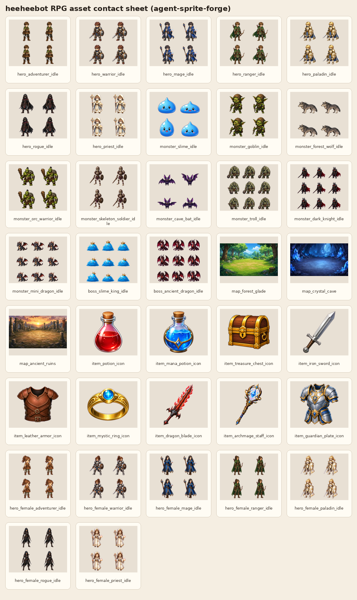
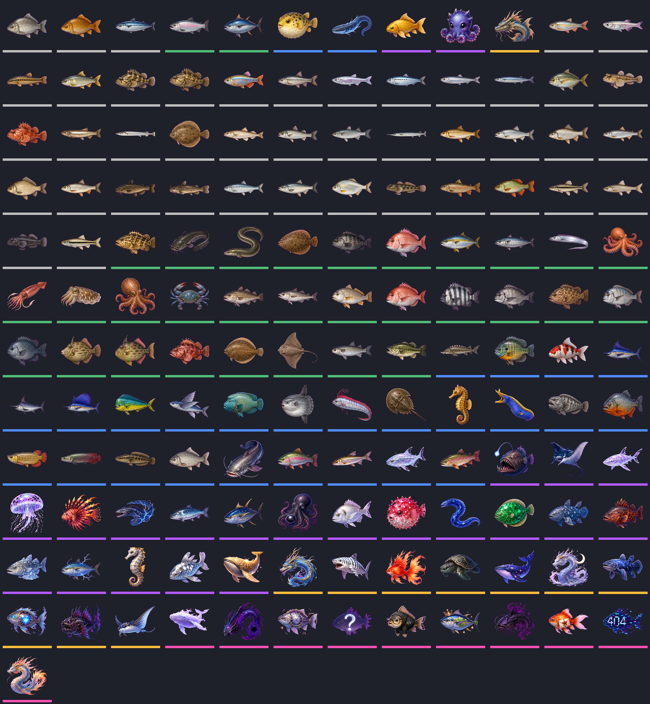

<div align="center">

# ✨ HeeHeeBot

**희희봇은 라이빗을 침공한 터미네이터 희진이다.**


`/도움말` 하나로 시작해서 `/오늘할일`, `/프로필`, `/rpg 메뉴`, `/희진다마고치`까지 이어지는 서버용 올인원 놀이 플랫폼입니다.


</div>

---

## 📌 목차

- [한눈에 보기](#-한눈에-보기)
- [기능 하이라이트](#-기능-하이라이트)
- [버전 관리](#-버전-관리)
- [빠른 시작](#-빠른-시작)
- [환경 변수](#-환경-변수)
- [명령어 치트시트](#-명령어-치트시트)
- [자주 쓰는 플레이 예시](#-자주-쓰는-플레이-예시)
- [프로젝트 구조](#-프로젝트-구조)
- [개발·검증 명령](#-개발검증-명령)
- [운영 메모](#-운영-메모)
- [라이선스](#-라이선스)

---

## 🧭 한눈에 보기

| 항목 | 내용 |
| --- | --- |
| 봇 성격 | Discord 서버용 레벨·경제·게임·관리 통합 봇 |
| 런타임 | Node.js `>=22.5` |
| Discord SDK | `discord.js` v14 |
| 저장소 | SQLite 기본값: `data/profiles.sqlite` |
| 명령어 등록 | `npm start` 시 자동 동기화, 수동은 `npm run register` |
| 테스트 | `node --test` 기반 도메인/라우팅/커맨드 테스트 |
| 현재 커맨드 규모 | 최상위 slash command 97개 + 다수 subcommand |
| 현재 버전 | `v0.10.0` — 1.0 이전 개발 버전 |
| 버전 산정 근거 | `v0.9.0` 마피아 기능 기준선에 이모지경마 다인 배당판 패치를 더해 `v0.9.1`로 산정 |

### 추천 첫 동선

```text
/도움말       # 카테고리별 명령어 탐색
/계정연동     # 여러 서버 계정이 있다면 먼저 통합
/출석         # 매일 보상 수령
/오늘할일     # 받을 수 있는 보상과 오늘 목표 확인
/프로필       # 성장/골드/RPG/주식/칭호 요약 확인
```

---

## 🌈 기능 하이라이트

<table>
<tr>
<td width="50%" valign="top">

### 💰 성장·경제

- 채팅 XP, 일일 출석, 자동 레벨업
- 골드 송금, 랭킹, 계정 연동
- 프로필 카드와 레벨 구간별 성장 배지
- 통합 골드 사용처와 기존 지갑 정산 안내

</td>
<td width="50%" valign="top">

### 🏘️ 커뮤니티

- 전역 업적, 칭호 도감, 일일/주간 미션
- 서버 공용 6/45 잭팟 복권
- 상점, 서버 이벤트, 활동 요약
- 통합 시즌 포인트·과제·보상

</td>
</tr>
<tr>
<td width="50%" valign="top">

### 🎮 미니게임

- 끝말잇기, 초성게임, 라이어게임, 마피아, 우노
- 워들, 숫자야구, 선택, 투표, 궁합
- 카지노류 게임: 홀짝, 슬롯, 블랙잭, 룰렛 등
- 모든 도박/주식은 **봇 내부 골드 전용**

</td>
<td width="50%" valign="top">

### 🏫 학교 생활

- NEIS 급식 조회와 자동 급식 알림
- 컴시간 기반 시간표 조회
- 오늘/내일/특정 요일/이번주/다음주 조회
- 인천과학고등학교 기준 데이터 사용

</td>
</tr>
<tr>
<td width="50%" valign="top">

### 🐣 수집·육성

- 희진 다마고치 케어, 성장, 스킨, 방꾸미기
- 낚시, 낚시도감, 낚싯대 강화, 잠수 보상
- 물고기 팀 설정과 물고기배틀
- 검 강화, 보호권, 판매, 도감, 배틀

</td>
<td width="50%" valign="top">

### ⚔️ RPG·시장

- RPG 시작/메뉴/사냥/탐사/던전/보스/레이드
- 직업/전직, 스토리/도감, 제작/거래소
- 디코밈 가상주식 현물·지정가·알림·레버리지
- 뉴스/차트/거래내역/랭킹 제공

</td>
</tr>
</table>

### 🖼️ 자산 미리보기

| RPG 카드 | 낚시 아이콘 | 검 대장장이 |
| --- | --- | --- |
|  |  |  |

---

## 🧩 버전 관리

> 현재 희희봇은 **1.0.0 정식 안정화 전 개발 버전**입니다. 기능은 많이 들어갔지만, 운영 서버에서 계속 밸런스·UX·버그 수정이 일어날 수 있습니다.

### 현재 버전

| 항목 | 값 |
| --- | --- |
| 현재 버전 | `v0.10.0` |
| npm package version | `0.10.0` |
| 기준 커밋 범위 | `d6b539a` → `919b758` + working tree |
| 기준 커밋 수 | 119 commits + working tree |
| 최신 기준 커밋 | `919b758` — `Merge branch 'main' of https://github.com/jsk1004ha/heeheebot` |
| 릴리스 상태 | Pre-1.0: 기능 확장과 안정화가 동시에 진행 중 |

### 버전 규칙

희희봇은 SemVer 기반의 `0.x` 버전 표기를 사용합니다.

```text
vMAJOR.MINOR.PATCH
```

| 구분 | 올리는 기준 | 예시 |
| --- | --- | --- |
| `MAJOR` | 저장소/DB/명령어 계약이 크게 깨지는 변경 | `v1.0.0` |
| `MINOR` | 큰 기능군 추가: RPG 시즌, 가상주식, 다마고치 등 | `v0.9.0` |
| `PATCH` | 버그 수정, 밸런스 조정, 문서/UX 개선 | `v0.8.2` |

### 커밋 기록 기반 마일스톤

커밋이 단순 초기 작업 수준을 넘어 여러 기능군을 단계적으로 쌓았기 때문에, 기능 기준선은 `0.8.0`으로 두고 저장소 호환·성능 패치는 `0.8.x`로 관리합니다.

| 마일스톤 | 커밋 범위 | 핵심 변화 |
| --- | --- | --- |
| `0.1` | `d6b539a` → `a473749` | 초기 봇 기반, persistence, 경제/관리, 일일 XP, 자동 도배 대응 |
| `0.2` | `a8ff7a7` → `003fac9` | 운세, env 자동 로드, AI 끝말잇기, 경제 플랫폼 확장 |
| `0.3` | `9a9337c` → `09f021b` | 게임 시스템 확장, SQLite migration, 가상주식, 검 강화, RPG 루프 |
| `0.4` | `a8b1dd1` → `aa6e20f` | 급식/시간표, 통합 골드 경제, 희진 다마고치, 낚시 카드 |
| `0.5` | `2559229` → `624ee46` | RPG/프로필 UX, 다마고치 정리, 성장 배지, 유저 슬로우모드 |
| `0.6` | `a3e5df3` → `1da4660` | 통합 게임 UX, stock pagination, RPG assets, 시즌 루프, 주식 알림 |
| `0.7` | `7cff5b4` → `8e9089b` | 인터랙션 안정화, 채팅 노이즈 감소, 중복 버튼 방지, 구조 리팩터링, RPG 테스트 보강 |
| `0.8` | `f8fa883` → `2ece970` | 계정 연동, 워들/숫자야구/투표 테스트, command startup sync, 자동급식 권한 체크, 도움말 개선 |

### 커밋 기록 기반 릴리스 노트

#### `v0.10.0` — Lavalink/yt-dlp 음악 시스템

- **기본 음악 명령**: `/재생`, `/검색`, `/일시정지`, `/다시재생`, `/스킵`, `/정지`, `/큐` 추가
- **인터랙티브 패널**: 현재곡 embed와 버튼으로 일시정지, 스킵, 반복, 셔플, 큐, 필터 제어
- **플레이리스트**: `/플리 생성|추가|재생|공개|가져오기`로 개인/공개 플레이리스트 관리
- **서버 문화 기록**: `/랭킹 종류:인기곡`, `/내음악통계`로 인기곡·아티스트·장르 신청 기록 저장
- **자동 런타임 세팅**: `npm start` 시 로컬 Lavalink.jar, `application.yml`, YouTube source plugin 설정, yt-dlp 바이너리를 `data/music-runtime`에 자동 준비

#### `v0.9.1` — 이모지경마 다인 배당판

- **다인 베팅 로비**: `/이모지경마`가 단일 즉시 정산 대신 참가/나가기/시작 버튼이 있는 경마판을 생성
- **배당풀 정산**: 총 베팅금에서 운영 수수료를 제외한 배당풀을 우승 동물 적중자끼리 베팅 지분 비례로 분배
- **실시간 배당 표시**: 참가자 수, 동물별 베팅액, 현재 배당률, 총 베팅금과 배당풀을 embed에 표시
- **예약금 보호**: 참가·선택 변경·나가기·취소·만료·실패 흐름에서 예약 베팅금 중복/누락 정산을 방어
- **회귀 검증**: 카지노 경마 배당 테스트를 추가하고 전체 `node --test` 회귀를 통과

#### `v0.9.0` — 공개 혼합 투표 마피아 게임

- **마피아 파티 게임 추가**: 라이어게임/끝말잇기식 버튼 로비 매칭으로 참가자를 모집하고 방장이 즉시 시작 가능
- **기본 직업 구성**: 마피아, 경찰, 의사, 시민을 인원수에 맞춰 배정하고 각자 비공개 버튼으로 역할 확인
- **밤/낮 루프**: 마피아 습격, 경찰 조사, 의사 치료 후 낮 토론과 재판으로 진행
- **공개 혼합 투표**: 자유투표로 처형 후보를 정한 뒤 찬반투표로 처형 여부를 확정하며, 모든 투표자/득표 현황을 공개
- **유령 직업 공개 옵션**: `/마피아 시작 유령직업공개:true|false`로 사망자 직업 공개 여부를 선택

#### `v0.8.2` — 계정 fast-path 저장소

- **고속 계정 테이블 추가**: `bot_account_profiles`, `bot_account_guild_memberships`에 고빈도 계정 데이터를 컬럼화해 투영
- **자동 v4 이전**: 기존 v3 정규화 DB를 열면 계정 hot table을 자동 생성·채움
- **fast-path API**: 계정/feature user 단일 row 조회·갱신 API를 추가하고 메시지/명령어/경험치 보상 경로에 적용
- **SQLite 튜닝**: WAL, `synchronous=NORMAL`, `busy_timeout`으로 일반 운영 읽기/쓰기 병목 완화

#### `v0.8.1` — 정규화 SQLite 저장소

- **DB 방식 변경**: 범용 `bot_state_nodes` 경로 행 저장에서 root/global/guild/user/feature 단위 정규화 테이블로 전환
- **기존 데이터 이전**: 이전 `bot_state_nodes`, 구 SQLite 단일 JSON(`bot_state`), legacy JSON 파일을 빈 새 스키마로 자동 마이그레이션
- **호환성 유지**: 기존 서비스의 `load/view/save/update` API와 도메인 상태 shape는 유지
- **저장소 테스트**: 정규화 persistence, legacy migration, rollback, sparse array 방어, 행 단위 delta 갱신 검증

#### `v0.8.0` — 통합 기능 기준선

커밋 히스토리 기준으로 다음 기능들이 현재 버전에 포함되어 있습니다.

- **Discord 운영 기반**: `.env` 자동 로드, 시작 시 slash command 자동 동기화, 수동 `npm run register`, 도움말 개선
- **계정·성장·경제**: 통합 골드 경제, 출석/채팅 XP, 프로필 성장 배지, 계정 연동, 송금, 랭킹
- **전역 업적 루프**: RPG·낚시·검강화·주식·다마고치·커뮤니티 기록을 한 업적/칭호 도감으로 수집
- **커뮤니티 루프**: 일일/주간 미션, 복권, 서버 이벤트, 활동 요약
- **시즌 시스템**: 일일/주간 시즌 과제, 시즌 포인트, 시즌 랭킹과 보상
- **학교 기능**: NEIS 급식, 자동 급식 알림, 컴시간 시간표, 권한 체크 보강
- **미니게임**: 끝말잇기, 초성게임, 라이어게임, 마피아, 우노, 워들, 숫자야구, 투표, 선택, 궁합, 운세
- **육성·수집**: 희진 다마고치, 낚시/도감/강화/잠수, 검 강화/도감/판매/배틀
- **RPG**: 캐릭터, 사냥, 탐사, 던전, 보스, 레이드, 직업/전직/스토리/도감, 제작/거래소, 버튼형 메뉴
- **가상주식·카지노**: 현물/지정가/알림/레버리지, 시장 뉴스/차트, 다양한 카지노 게임
- **관리·안정화**: 경고/뮤트/킥/밴, 자동 도배 대응, 유저 슬로우모드 해제, 중복 버튼 ID 방지, Discord 응답 길이/페이지 처리
- **저장소·테스트**: SQLite 저장소, legacy JSON migration, 497개 `node --test` 테스트로 주요 도메인 검증

### 릴리스 작성 절차

```bash
# 1. 커밋 요약 확인
git log --date=short --pretty=format:'%h %ad %s'

# 2. package.json / package-lock.json 버전 갱신
npm version 0.10.0 --no-git-tag-version

# 3. 테스트
npm test

# 4. 태그 생성 예시
git tag -a v0.10.0 -m "HeeHeeBot v0.10.0"
```

---

## 🚀 빠른 시작

### 1) 설치

```bash
npm install
cp .env.example .env
```

### 2) `.env` 작성

최소 필수값은 Discord 봇 토큰과 애플리케이션 ID입니다.

```env
DISCORD_TOKEN=your_bot_token_here
DISCORD_CLIENT_ID=your_application_client_id_here
```

### 3) 봇 실행

```bash
npm start
```

`npm start`는 시작 전에 slash command를 자동으로 동기화합니다. 개발 서버에 빠르게 등록하려면 `.env`에 `DISCORD_GUILD_ID`를 넣으세요.
음악 기능은 `MUSIC_AUTO_SETUP=true` 기본값으로 `data/music-runtime`에 Lavalink/yt-dlp 런타임을 자동 준비하고 로컬 Lavalink 노드를 실행합니다. 단, Lavalink 실행에는 시스템에 Java 17 이상이 설치되어 있어야 합니다.

### 4) 명령어만 수동 동기화

```bash
npm run register
```

> 채팅 XP, 금칙어 감지, 자동 도배 대응, 끝말잇기/초성게임 같은 메시지 기반 기능을 쓰려면 Discord Developer Portal에서 **Message Content Intent**를 켜야 합니다.

---

## 🔐 환경 변수

| 변수 | 필수 | 기본값 | 설명 |
| --- | --- | --- | --- |
| `DISCORD_TOKEN` | ✅ | - | Discord bot token |
| `DISCORD_CLIENT_ID` | ✅ | - | Discord application/client ID |
| `DISCORD_GUILD_ID` | 선택 | - | 개발 중 특정 길드에 즉시 slash command 등록 |
| `REGISTER_COMMANDS_ON_STARTUP` | 선택 | `true` | `npm start` 시 명령어 자동 동기화 여부 |
| `NEIS_API_KEY` | 선택 | sample-key 동작 | 급식 API 키. 없으면 공개/sample 동작 사용 |
| `BOT_SQLITE_PATH` | 선택 | `data/profiles.sqlite` | SQLite DB 파일 경로 |
| `BOT_JSON_MIGRATION_PATH` | 선택 | `data/profiles.json` | 첫 실행 시 가져올 legacy JSON 경로 |
| `MUSIC_AUTO_SETUP` | 선택 | `true` | `npm start` 시 로컬 음악 런타임 자동 다운로드/설정 |
| `MUSIC_RUNTIME_DIR` | 선택 | `data/music-runtime` | 자동 다운로드한 Lavalink.jar, application.yml, yt-dlp 저장 위치 |
| `LAVALINK_HOST` | 선택 | - | 외부 Lavalink 노드를 쓸 때만 지정. 비어 있으면 로컬 자동 세팅 |
| `LAVALINK_PORT` / `LAVALINK_PASSWORD` | 선택 | `2333` / `youshallnotpass` | 로컬/외부 Lavalink 접속 설정 |
| `LAVALINK_AUTO_START` | 선택 | `true` | 자동 세팅한 로컬 Lavalink 프로세스 실행 여부 |
| `YTDLP_ENABLED` / `YTDLP_AUTO_DOWNLOAD` | 선택 | `true` / `true` | yt-dlp 메타데이터 fallback과 바이너리 자동 다운로드 |

> `.env`는 절대 커밋하지 마세요. 예시는 `.env.example`에만 남겨둡니다.

---

## 🧾 명령어 치트시트

### 핵심 성장·경제

| 명령어 | 설명 |
| --- | --- |
| `/프로필` | 레벨, 경험치, 골드, 성장 배지, RPG/검/주식/칭호 요약 |
| `/출석` | 하루 한 번 XP와 골드 보상 수령 |
| `/오늘할일` | 출석, 운세 XP, 미션, 시즌, RPG 일일 목표를 한 번에 확인 |
| `/송금` | 다른 유저에게 골드 송금 |
| `/랭킹` | 서버 레벨/경험치 랭킹 |
| `/랭킹 종류:인기곡` | 서버에서 가장 많이 재생된 음악 TOP 10 |
| `/재화정보` | 통합 골드 사용처와 지갑 정산 기준 |
| `/계정연동` | 여러 서버의 희희봇 계정 중 하나를 선택해 통합 |

### 음악

| 명령어 | 설명 |
| --- | --- |
| `/재생 검색어` | 검색어 또는 URL로 노래를 찾아 즉시 재생 |
| `/검색 검색어` | 상위 5개 결과를 버튼으로 보여주고 선택한 곡 재생 |
| `/일시정지` / `/다시재생` | 현재 곡 일시정지/재개 |
| `/스킵` / `/정지` | 현재 곡 넘기기 / 재생 중지와 큐 비우기 |
| `/큐` | 현재곡과 대기열을 embed로 확인 |
| `/플리 생성|추가|재생|공개|가져오기` | 개인/공개 플레이리스트 관리 |
| `/내음악통계` | 내가 많이 신청한 장르, 아티스트, 곡 수 확인 |

### 커뮤니티·시즌

| 명령어 | 설명 |
| --- | --- |
| `/업적 분류 보기` | 커뮤니티/RPG/낚시/검강화/주식/다마고치 통합 업적 진행도와 보상 수령 |
| `/칭호 보기\|선택` | 칭호 도감 확인, 보유/미보유 필터, 장착/해제 |
| `/미션` | 일일·주간 미션 확인 및 보상 수령 |
| `/복권 현황\|구매\|대량구매\|추첨\|자동추첨` | 서버 공용 6/45 잭팟 복권 |
| `/상점 목록\|구매` | 칭호와 배지 꾸미기 구매 |
| `/서버이벤트 상태\|시작` | 채팅 XP, 미션 보상, 복권 잭팟 이벤트 |
| `/활동요약` | 최근 7일 채팅/명령어 활동과 XP 요약 |
| `/시즌 정보\|랭킹\|보상\|과제\|과제보상` | 통합 시즌 포인트와 보상 관리 |

### 학교·생활 편의

| 명령어 | 설명 |
| --- | --- |
| `/급식` | 인천과학고등학교 오늘 급식 조회 |
| `/자동급식 설정\|해제\|상태` | 매일 00:00 KST 급식 자동 알림 |
| `/시간표` | 학년/반별 컴시간 시간표 조회 |
| `/운세` | 오늘/어제/내일 운세 확인. 같은 유저+날짜는 항상 같은 결과 |
| `/선택` | 여러 후보 중 하나를 랜덤 선택 |
| `/궁합` | 두 이름으로 재미용 궁합 계산 |
| `/투표` | 숫자 반응 기반 투표 생성 |

### 파티·퍼즐 게임

| 명령어 | 설명 |
| --- | --- |
| `/끝말잇기 시작` | AI 포함 또는 유저끼리 끝말잇기 |
| `/초성게임 시작` | 랜덤 2글자 초성으로 한국어 단어 맞히기 |
| `/라이어게임 시작`, `/라이어게임 제출` | 시민과 라이어가 제시어를 설명하고 투표 |
| `/마피아 시작\|상태\|종료` | 로비 매칭 후 밤 능력과 공개 혼합 투표로 마피아 진행 |
| `/우노 시작\|손패\|내기\|뽑기` | 버튼으로 방을 만들고 기본 스태킹+Seven-O 또는 No Mercy 모드로 우노 진행 |
| `/워들 도전\|상태\|랭킹` | 하루 한 번 모두가 같은 5글자 영어 단어 맞히기 |
| `/숫자야구 도전\|상태` | 4자리 숫자를 스트라이크/볼 힌트로 맞히기 |

### 희진 다마고치

| 명령어 | 설명 |
| --- | --- |
| `/희진다마고치` | 배부름/행복/청결/에너지/건강/애정 확인과 버튼 케어 |
| `/희진여가` | 릴스보기, 디맥하기, 산책 등 여가 실행 |
| `/희진스킨`, `/희진꾸미기` | 스킨과 장식 장착 |
| `/희진방`, `/희진앨범`, `/희진일기` | 방꾸미기, 도감, 케어 기록 확인 |
| `/희진방문`, `/희진퀘스트` | 다른 유저 방 방문과 성장 분기 퀘스트 |

### 낚시·검 강화

| 명령어 | 설명 |
| --- | --- |
| `/낚시`, `/낚시도감` | 물고기 수집과 도감 확인 |
| `/낚시강화`, `/잠수` | 낚싯대 강화와 방치 보상 |
| `/물고기팀설정`, `/물고기배틀` | 물고기 팀 구성과 배틀 |
| `/선물받기` | 하루 한 번 제련석 수령 |
| `/검강화`, `/검상급강화` | 유지/파괴/보호권, 파괴 보너스 확률, 상급강화 +1~+5 상승을 포함한 검 강화 |
| `/검정보`, `/검도감`, `/검업적` | 검 상태, 해금 이미지, 업적 확인 |
| `/검보호권`, `/검판매`, `/검랭킹`, `/검배틀`, `/묵념` | 보호권 구매, 판매, 랭킹, 배틀, 검 추모 |

### RPG

| 명령어 | 설명 |
| --- | --- |
| `/rpg 시작` | 캐릭터 생성/시작 |
| `/rpg 메뉴` | RPG 버튼 허브 |
| `/rpg 튜토리얼` | 신규 유저 가이드와 단계 보상 |
| `/rpg 사냥`, `/rpg 탐사`, `/rpg 던전`, `/rpg 보스` | 전투·탐험·던전·보스 진행 |
| `/rpg 프로필`, `/rpg 인벤토리`, `/rpg 장비` | 캐릭터 상태와 아이템/장비 관리 |
| `/rpg 상점`, `/rpg 강화`, `/rpg 제작`, `/rpg 거래소` | 구매, 강화, 제작, 거래 |
| `/rpg 스토리`, `/rpg 도감`, `/rpg 일일`, `/rpg 휴식` | 메인 퀘스트/도감/일일 의뢰/회복 |
| `/rpg 듀얼직업`, `/rpg 전직` | 성장 빌드 관리 (`/rpg 메뉴`의 성장 버튼에서 스킬트리 접근) |
| `/rpg 레이드`, `/rpg 길드레이드`, `/rpg 지역` | 레이드와 지역 진행 |

### 가상주식·카지노

| 명령어 | 설명 |
| --- | --- |
| `/주식 시세\|전체시세\|신규상장` | 디코밈 가상주식 시장 확인 |
| `/주식 매수\|매도\|지정가매수\|지정가매도` | 현물/지정가 거래 |
| `/주식 주문\|주문취소\|거래내역\|배당금\|뉴스\|차트` | 주문 관리, 배당금 수령, 시장 정보 |
| `/주식 알림설정\|알림\|알림삭제` | 가격 알림 관리 |
| `/주식 보유\|랭킹\|레버리지진입\|레버리지청산\|레버리지보유` | 자산/랭킹/부채 노출형 레버리지와 버튼·번호 청산 |
| `/카지노정보` | 도박 게임 배수와 환급 규칙 |
| `/홀짝`, `/주사위`, `/슬롯`, `/데드라인`, `/타이밍` | 간단 베팅 게임 |
| `/이모지경마`, `/럭키세븐`, `/하이로우`, `/블랙잭` | 다인 배당 경마, 버튼/카드형 게임 |
| `/룰렛`, `/바카라`, `/크랩스`, `/시크보`, `/키노` | 카지노 테이블 게임 |
| `/스크래치복권` | 2000만/1억/5억형 고정가 복권을 버튼으로 한 칸씩 긁어 같은 금액 3개 당첨 확인 |

> 가상주식과 카지노는 모두 **실제 현금, 실제 투자, 현금 환전 기능과 연결되지 않는 봇 내부 골드 컨텐츠**입니다.
> 상장폐지 종목은 보유 주식이 0골드 손실로 실현 처리되고, 관련 지정가 주문·가격 알림·레버리지는 자동 정리됩니다.
> 레버리지는 증거금 × 배율의 명목가와 부채 노출을 표시하고, 같은 종목 롱/숏 양방향 동시 진입을 막습니다.
> 기간 중 변동은 정산하지 않고 만기 턴 가격으로 자동 정산됩니다. 짧은 10~29턴은 1~10배, 30턴 이상은 1~100배까지 가능합니다.
> 거래가 1개뿐이면 `/주식 레버리지청산`만으로 중도 청산할 수 있지만, 중도 청산은 추가 수수료와 큰 위약금이 붙어 이익이 크게 줄어듭니다.

### 서버 관리

| 명령어 | 설명 |
| --- | --- |
| `/청소` | 최근 메시지 삭제 |
| `/경고`, `/경고확인`, `/경고삭제` | 경고 부여/조회/초기화 |
| `/뮤트`, `/언뮤트`, `/슬로우모드풀기` | 타임아웃과 자동 도배 슬로우모드 해제 |
| `/킥`, `/밴`, `/언밴` | 추방/차단/차단 해제 |
| `/관리설정 로그채널\|금칙어추가\|경고누적처벌` | 관리 로그, 금칙어, 누적 처벌 설정 |

자동 도배 대응은 기본적으로 5초 안에 메시지 8개 또는 같은 메시지 5회 반복 시 해당 유저만 5분 타임아웃하며, 자동 밴은 하지 않습니다.

---

## 🕹️ 자주 쓰는 플레이 예시

<details>
<summary><strong>커뮤니티 루틴</strong></summary>

```text
/출석
/오늘할일
/미션
/업적
/복권 구매 장수:3
/상점 목록
/시즌 정보
/시즌 과제
```

</details>

<details>
<summary><strong>학교 생활</strong></summary>

```text
/급식
/급식 식사:중식
/자동급식 설정 채널:#급식
/시간표 학년:1 반:1
/시간표 학년:1 반:1 조회:특정 요일 요일:수
```

</details>

<details>
<summary><strong>파티 게임</strong></summary>

```text
/끝말잇기 시작 모드:매너(한방단어 금지)
/초성게임 시작 제한시간:45
/라이어게임 시작 모드:어려움 설명턴수:2턴
/라이어게임 제출 내용:국물이 있는 따뜻한 음식
/마피아 시작 유령직업공개:true 토론시간:90 투표시간:45
/우노 시작 모드:기본(스태킹 + 세븐-O)
/워들 도전 단어:apple
/숫자야구 도전 숫자:0123
/투표 주제:점심 메뉴 복수선택:false 항목1:김치찌개 항목2:돈까스 항목3:국밥
```

</details>

<details>
<summary><strong>RPG·검·낚시</strong></summary>

```text
/rpg 시작
/rpg 메뉴
/rpg 사냥
/rpg 던전 깊이:3
/rpg 레이드
/선물받기
/검강화
/검상급강화
/검배틀 상대:@유저
/낚시
/낚시강화
/물고기배틀
```

</details>

<details>
<summary><strong>가상주식·카지노</strong></summary>

```text
/주식 시세
/주식 매수 종목:<자동완성에서 선택> 수량:10
/주식 지정가매수 종목:<자동완성에서 선택> 수량:10 가격:750
/주식 배당금
/주식 알림설정 종목:<자동완성에서 선택> 조건:이상 가격:1000
/주식 레버리지진입 종목:<자동완성에서 선택> 방향:롱 배율:10 기간:10 증거금:10000
/주식 레버리지청산
/주식 레버리지청산 대상:1
/카지노정보
/이모지경마 돈:100 선택:강아지
/블랙잭 500
/룰렛 100 빨강
/키노 100 3,14,25
/스크래치복권 종류:미니 2000만
```

</details>

<details>
<summary><strong>서버 관리</strong></summary>

```text
/관리설정 로그채널 #로그
/관리설정 금칙어추가 나쁜말
/관리설정 경고누적처벌 3 뮤트 10분
/경고 @유저 도배
/뮤트 @유저 10분 도배
/청소 30
```

봇 역할은 관리 대상 유저보다 위에 있어야 하며, 필요한 권한은 `메시지 관리`, `멤버 타임아웃`, `킥`, `밴`, `서버 관리`입니다.

</details>

---

## 🧱 프로젝트 구조

```text
heeheebot/
├─ src/
│  ├─ index.js                  # dotenv 로드, command sync, bot start
│  ├─ bot.js                    # Discord client, interaction/message routing
│  ├─ command-registration.js   # slash command payload 수집/등록
│  ├─ config.js                 # 환경변수 파싱
│  ├─ commands/                 # slash command 정의와 interaction handler
│  ├─ systems/                  # 도메인 로직: 경제, RPG, 주식, 시즌, 게임 등
│  └─ storage/                  # 정규화 SQLite 저장소와 migration
├─ assets/                      # RPG/희진/낚시/검/프로필 이미지 자산
├─ data/                        # DB, 단어 목록, 게임 데이터
├─ docs/                        # 자산 파이프라인 문서
├─ tests/                       # node:test 기반 테스트
├─ tools/                       # 단어/이미지/자산 생성 유틸
├─ .env.example                 # 환경변수 예시
└─ package.json                 # scripts, engines, dependencies
```

### 책임 분리

- `src/commands/*`: Discord 입력, 옵션, embed/button 응답 조립
- `src/systems/*`: 순수 게임/경제/관리 로직과 상태 계산
- `src/storage/sqlite-store.js`: 영속성, 정규화 SQLite schema, legacy migration
- `assets/*` + `tools/*`: 봇 응답에 붙는 이미지와 생성 파이프라인
- `tests/*`: 커맨드 등록, 라우팅, 도메인 규칙 검증

---

## 🧪 개발·검증 명령

```bash
npm test          # 전체 테스트
npm run register  # slash command만 수동 동기화
npm start         # 명령어 자동 동기화 후 봇 시작
```

`npm test`는 실제 Discord 계정 없이 가짜 유저 ID와 임시 SQLite DB를 사용해 핵심 로직을 검증합니다.

---

## 🛠️ 운영 메모

### Discord Developer Portal 체크리스트

- [ ] Bot token 발급 후 `DISCORD_TOKEN` 설정
- [ ] Application ID를 `DISCORD_CLIENT_ID`에 설정
- [ ] 테스트 서버 빠른 등록이 필요하면 `DISCORD_GUILD_ID` 설정
- [ ] **Message Content Intent** 활성화
- [ ] 봇 초대 시 slash command, 메시지 전송, embed, 파일 첨부, 반응, 관리 권한 확인

### 저장소·마이그레이션

- 기본 SQLite 경로는 `data/profiles.sqlite`입니다.
- v0.8.1부터 새 저장 데이터는 root/global/guild/user/feature 정규화 테이블에 기록됩니다.
- v0.8.2부터 계정 프로필/서버 멤버십은 고속 조회용 hot table에도 자동 투영됩니다.
- 기존 `bot_state_nodes` 행 저장소, 구 SQLite 단일 JSON(`bot_state`), `data/profiles.json`은 새 DB가 비어 있으면 첫 실행 때 자동으로 가져옵니다.
- DB 경로를 바꾸려면 `BOT_SQLITE_PATH`를 사용하세요.

### 자동 스케줄러

- 급식 자동 알림: 서버별 `/자동급식 설정`
- 주식 가격 알림: `/주식 알림설정`
- 복권 자동 추첨: `/복권 자동추첨`

---

## 📚 참고 문서

- [`docs/rpg-asset-pipeline.md`](./docs/rpg-asset-pipeline.md)
- [`docs/fishing-asset-pipeline.md`](./docs/fishing-asset-pipeline.md)
- [`assets/tamagotchi/README.md`](./assets/tamagotchi/README.md)
- [`assets/rpg/README.md`](./assets/rpg/README.md)
- [`assets/fishing/README.md`](./assets/fishing/README.md)
- [`assets/sword/blacksmith/README.md`](./assets/sword/blacksmith/README.md)

---

## 📄 라이선스

이 프로젝트는 [Apache License 2.0](./LICENSE)을 따릅니다.

<div align="center">

**희희봇과 함께 서버를 조금 더 시끄럽고, 조금 더 재미있게.** 🎉

</div>
